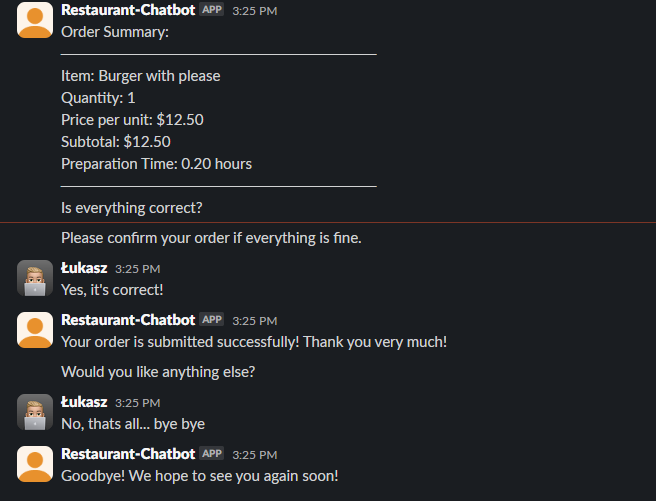

<h3 align="center">Restaurant-Chatbot</h3>

  <p align="center">
    Rule-based Restaurant Chatbot written with Python3 and Rasa
  </p>

## Paths

1. **Opening hours** - The user can ask about the opening hours on a particular day


2. **List a Menu** - The user can request a restaurant menu


3. **Place an Order** - The user may place an order





## How To Use

1. Install required packages from requirements.txt
2. Overwrite values in the credentials.yml file [(more info)](https://rasa.com/docs/rasa/connectors/slack/)
3. Run following commands: (you will need following a publicly available URL for Slack)

```
rasa train
```
```
rasa run
```
4. Everything is ready, you can use Restaurant-Chatbot on your Slack channel
